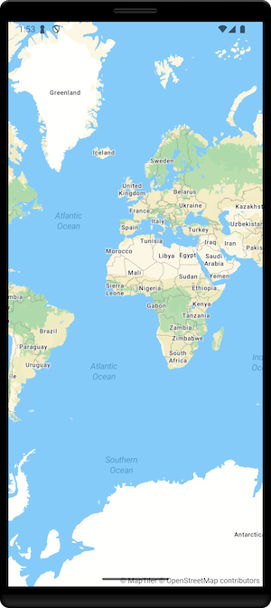
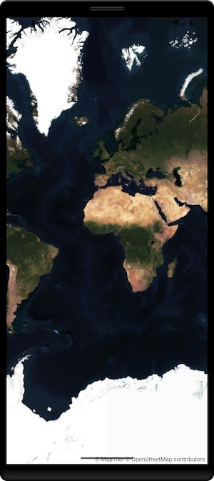

# MapTiler SDK Kotlin
<p align="center">

</p>


The MapTiler SDK Kotlin is a native SDK written in Kotlin, designed to work with the well-established MapTiler Cloud service, which provides all the data required to fuel a complete mobile mapping experience: vector tiles, GeoJSON, map interaction, custom styles, data visualization and more.

## Features
- [x] Map interaction
- [x] Pre-made map styles
- [x] VectorTile and GeoJSON sources
- [x] Fill, Line and Symbol layers
- [x] Custom Annotation Views
- [x] Location tracking
- [x] Globe and 3D Terrain

## Basic Usage

Make sure to set your MapTiler Cloud API key first:

```kotlin
MTConfig.apiKey = "YOUR_API_KEY"
```

### Jetpack Compose

Instantiate controller (with or without delegate) and the map view:

```kotlin
import com.maptiler.maptilersdk.map.MTMapOptions
import com.maptiler.maptilersdk.map.MTMapView
import com.maptiler.maptilersdk.map.MTMapViewController
import com.maptiler.maptilersdk.map.style.MTMapReferenceStyle

val controller = MTMapViewController(context)

MTMapView(
            MTMapReferenceStyle.STREETS,
            MTMapOptions(),
            controller,
            modifier =
                Modifier
                    .fillMaxSize(),
        )
```

### XML

Add MTMapViewClassic to your layout XML:

```xml
<?xml version="1.0" encoding="utf-8"?>
<LinearLayout xmlns:android="http://schemas.android.com/apk/res/android"
    android:layout_width="match_parent"
    android:layout_height="match_parent"
    android:orientation="vertical" >
    <com.maptiler.maptilersdk.map.MTMapViewClassic
        android:id="@+id/classicMapView"
        android:layout_height="match_parent"
        android:layout_width="match_parent" />
</LinearLayout>
```

Instantiate the MTMapViewClassic:

```kotlin
 import com.maptiler.maptilersdk.map.MTMapOptions
 import com.maptiler.maptilersdk.map.MTMapViewClassic
 import com.maptiler.maptilersdk.map.MTMapViewController
 import com.maptiler.maptilersdk.map.style.MTMapReferenceStyle

private lateinit var mapView: MTMapViewClassic

    override fun onCreate(savedInstanceState: Bundle?) {
        super.onCreate(savedInstanceState)

        MTConfig.apiKey = "YOUR_API_KEY"
        val controller = MTMapViewController(baseContext)
        enableEdgeToEdge()
        setContentView(R.layout.main_activity_layout)

        mapView = findViewById(R.id.classicMapView)
        mapView.initialize(MTMapReferenceStyle.SATELLITE, MTMapOptions(), controller)
    }
```

For a detailed functionality overview, refer to the API reference documentation.

## Sources and Layers

Sources and layers can be added to the map view style object as soon as the map is initialized. Setting the style after adding layers resets them to default, so make sure the style has finished loading first.

```kotlin
val sourceURL = URL("https://api.maptiler.com/tiles/v3-openmaptiles/tiles.json?key=$YOUR_API_KEY")
val source = MTVectorTileSource("openmapsource", sourceURL)
controller.style?.addSource(source)
```

```kotlin
try {
    val layer = MTFillLayer("fillLayer", "openmapsource")
    layer.color = Color.Blue.toArgb()
    layer.outlineColor = Color.Cyan.toArgb()
    layer.sourceLayer = "aeroway"
    controller.style?.addLayer(layer)
} catch (error: MTStyleError) {
    Log.e("MTStyleError", "Layer already exists.")
}
```


## Markers and Popups

```kotlin
val lngLat = LngLat(43.2352, 19.4567)
val marker = MTMarker(lngLat, Color.Blue.toArgb())
controller.style?.addMarker(marker)
```

```kotlin
val lngLat = LngLat(43.2352, 19.4567)
val popup = MTTextPopup(lngLat, "My Text")
controller.style?.addTextPopup(popup)
```

## Events

Optionally wrap the map controller in a class to observe the map events and use the wrapper class controller for map manipulation.

```kotlin
class MapController(
    private val context: Context,
) : MTMapViewDelegate {
    val controller: MTMapViewController =
        MTMapViewController(context).apply {
            delegate = this@MapController
        }

    override fun onMapViewInitialized() {
        Log.i("Init", "Map View Initialized.")
    }

    override fun onEventTriggered(
        event: MTEvent,
        data: MTData?,
    ) {
        Log.i("Event", "Map View Event Triggered: $event.")
    }
}
```

## Custom Annotations

Render your own UI as map annotations.

Compose — overlay on top of MTMapView

```kotlin
Box(Modifier.fillMaxSize()) {
    MTMapView(MTMapReferenceStyle.STREETS, MTMapOptions(), controller, Modifier.fillMaxSize())

    MTCustomAnnotationView(
        controller = controller,
        coordinates = LngLat(16.6, 49.2),
        modifier = Modifier,
    ) {
        // Your composable content here (e.g., a Card or Icon)
    }
}
```

XML (Classic) — add a view above MTMapViewClassic

```kotlin
// Create with desired size in pixels and initial coordinates
val customView = MTCustomAnnotationViewClassic(
    context = this,
    widthPx = 120,
    heightPx = 48,
    initialCoordinates = LngLat(16.6, 49.2),
)

// Attach above the WebView and start updates
customView.addTo(mapView /* MTMapViewClassic */, controller)

// Update position later
customView.setCoordinates(LngLat(16.7, 49.25), controller)

// Remove when no longer needed
customView.remove()
```

## Space

The space option customizes the globe’s background, simulating deep space or skybox effects.

- Prerequisite: use globe projection. Set `projection = MTProjectionType.GLOBE` in `MTMapOptions`.

Usage — solid color background

```kotlin
val controller = MTMapViewController(context)

val options = MTMapOptions(
    projection = MTProjectionType.GLOBE,
    space = MTSpaceOption.Config(
        MTSpace(
            color = Color(0xFF111122).toArgb(),
        ),
    ),
)

MTMapView(
    MTMapReferenceStyle.STREETS,
    options,
    controller,
    modifier = Modifier.fillMaxSize(),
)
```

Presets — predefined cubemaps

- `SPACE`: Dark blue background; stars stay white. Space color changes background color.
- `STARS` (default): Black background; space color changes stars color.
- `MILKYWAY`: Black half‑transparent background with standard milky way and stars; space color tints stars and milky way.
- `MILKYWAY_SUBTLE`: Subtle milky way, fewer stars; space color tints stars and milky way.
- `MILKYWAY_BRIGHT`: Bright milky way, more stars; space color tints stars and milky way.
- `MILKYWAY_COLORED`: Full image with natural colors; space color has no effect.

```kotlin
val options = MTMapOptions(
    projection = MTProjectionType.GLOBE,
    space = MTSpaceOption.Config(MTSpace(preset = MTSpacePreset.SPACE)),
)
```

Custom cubemap — provide all faces

```kotlin
val faces = MTSpaceFaces(
    pX = "https://example.com/space/px.png",
    nX = "https://example.com/space/nx.png",
    pY = "https://example.com/space/py.png",
    nY = "https://example.com/space/ny.png",
    pZ = "https://example.com/space/pz.png",
    nZ = "https://example.com/space/nz.png",
)

val options = MTMapOptions(
    projection = MTProjectionType.GLOBE,
    space = MTSpaceOption.Config(MTSpace(faces = faces)),
)
```

Cubemap by path — files named px, nx, py, ny, pz, nz with the given format

```kotlin
val path = MTSpacePath(
    baseUrl = "https://example.com/spacebox/transparent",
    format = "png", // defaults to PNG if omitted
)

val options = MTMapOptions(
    projection = MTProjectionType.GLOBE,
    space = MTSpaceOption.Config(MTSpace(path = path)),
)
```

Dynamic updates — change space at runtime

```kotlin
// Call after the map is initialized (e.g., in MTMapViewDelegate.onMapViewInitialized)
controller.style?.setSpace(
    MTSpace(
        color = Color.Red.toArgb(),
        path = MTSpacePath(baseUrl = "https://example.com/spacebox/transparent"),
    ),
)
```

Note: When calling `setSpace`, any field not explicitly provided (e.g., color, faces, path, or preset) keeps its previous value.

## Halo

The halo option adds a gradient-based atmospheric glow around the globe, simulating the visual effect of Earth's atmosphere when viewed from space.

- Prerequisite: use globe projection. Set `projection = MTProjectionType.GLOBE` in `MTMapOptions`.

Enable during map initialization

```kotlin
val options = MTMapOptions(
    projection = MTProjectionType.GLOBE,
    halo = MTHaloOption.Enabled,
)
```

Custom gradient — scale and stops

```kotlin
val options = MTMapOptions(center = null, zoom = null, projection = MTProjectionType.GLOBE).apply {
    setHalo(
        MTHalo(
            scale = 1.5, // Controls the halo size
            stops = listOf(
                MTHaloStop(position = 0.2, color = "#00000000"),
                MTHaloStop(position = 0.2, color = "#FF0000"),
                MTHaloStop(position = 0.4, color = "#FF0000"),
                MTHaloStop(position = 0.4, color = "#00000000"),
                MTHaloStop(position = 0.6, color = "#00000000"),
                MTHaloStop(position = 0.6, color = "#FF0000"),
                MTHaloStop(position = 0.8, color = "#FF0000"),
                MTHaloStop(position = 0.8, color = "#00000000"),
                MTHaloStop(position = 1.0, color = "#00000000"),
            ),
        ),
    )
}
```

Dynamic updates — change halo at runtime

```kotlin
// Call after the map is initialized (e.g., in MTMapViewDelegate.onMapViewInitialized)
controller.style?.setHalo(
    MTHalo(
        scale = 2.0,
        stops = listOf(
            MTHaloStop(position = 0.0, color = "#87CEFA"),
            MTHaloStop(position = 0.5, color = "#0000FABF"),
            MTHaloStop(position = 0.75, color = "#FF000000"),
        ),
    ),
)
```

Disable animations — halo and space

```kotlin
// Call after initialization
controller.style?.disableHaloAnimations()
controller.style?.disableSpaceAnimations()
```

### Developer Docs
For more information and API Reference visit: https://docs.maptiler.com/mobile-sdk/android/ or browse ready-to-use code examples at the [Examples](https://github.com/maptiler/maptiler-sdk-kotlin/tree/main/Examples) directory in this repo.

# Installation
MapTiler Kotlin SDK is a Kotlin library and can be added as a dependency in your Gradle file (**Maven Central**):

- Make sure you have mavenCentral() added to your repositores inside your build.gradle
- Add the library as dependency in your module build.gradle file.

```kotlin
dependencies {
    implementation("com.maptiler:maptiler-sdk-kotlin:1.1.0")
}
```

Or, use Version Catalog instead, add following to the libs.versions.toml:

```kotlin
maptilerSdkKotlin = "1.1.0"

maptiler-sdk-kotlin = { module = "com.maptiler:maptiler-sdk-kotlin", version.ref = "maptilerSdkKotlin" }
```
Then add following implementation in your build.gradle:

```kotlin
implementation(libs.maptiler.sdk.kotlin)
```

<p align="center">


</p>

# License
MapTiler SDK Kotlin is released under the BSD 3-Clause license. See LICENSE for details.
